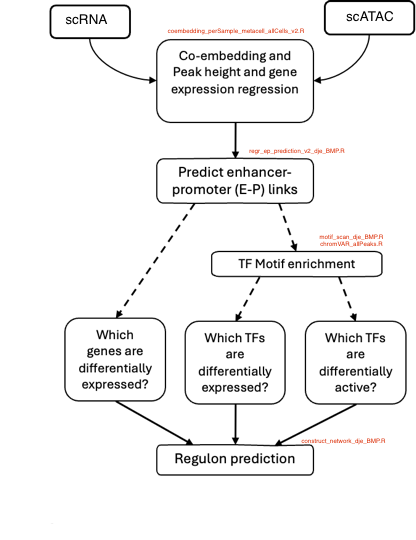

## TRN analysis
Scripts for Transcription Regulatory Network analysis (comparison of Bone Marrow Progenitor vs non Bone Marrow Progenitor like T-ALL patients (40)):

1. Run coembedding_perSample_metacell_allCells_v2.R --  co-embed and match scRNA-seq and scATAC-seq

   * output folder: Coembed_Results2_v2/
   * metacells generated: rna_metacell*, atac_metacell*    

2. Run regr_ep_prediction_v2_dje_BMP.R --  call e-p interactions by regression

   * output EP_Prediction2/regrRes4_EP_overall_5e6_0.10_fdr0.05_BMP.txt
   * Note: regression using thresholds of candidate enhancers 5 MB from TSS, FDR = 0.05, and weight = 0.1 

3. Run motif_scan_dje_BMP.R -- scan motifs on peaks

   * output MetaData2/motif_match_pvE-03.rds
   * output MetaData2/motif_match_pv5E-05.rds

4. Run script_chromVAR_allPeaks.R -- run chromVAR to obtain enriched TFs

   * output MetaData2/chromVar_output.rds
   
4. Run construct_network_dje_BMP.R -- construct final TRN

   * output folder: EP_Prediction2/
   * output Transcription Regulatory Network nodes example: TRN_nodes_enrichedTFs_in_BMP.txt
   * output Transcription Regulatory Network edges example: TRN_edges_enrichedTFs_in_BMP.txt
   * Note: generated a plot of upregulated genes in blue squares vs down-regulated red squares with green TF   
     - top significant TF edges (BMP_vs_nonBMP_100_tf_gene_TRN_plot.png)
     - total differential TF edges (BMP_vs_nonBMP_tf_gene_TRN_plot.png) 

